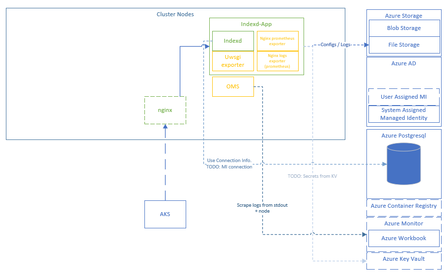

# Set up an Azure development environment

This guide will cover setting up an indexd development environment.

Here's an approach for the cloud settings, which are still to be further investigated.

## TODO: Cloud Settings.

For Azure, please see the starter `bash` [Azure script](./azure-setup.sh).
> Walking through the script line by line is advisable, and once understood, it can be used as the basis for further automation.

The deployment assumes the host context has rights to provision the following in an Azure subscription:
* Azure Postgresql
* Azure Storage (File Shares)
* AKS
* AAD rights (for creating Managed Identity)
* Azure Container Registry
* Azure Monitor

Further, you'll also want to make sure you have:
* [Azure CLI](https://docs.microsoft.com/en-us/cli/azure/install-azure-cli)
* Docker [on Linux](https://docs.docker.com/engine/install/ubuntu/) / [on Windows](https://docs.docker.com/docker-for-windows/install/)
* [Kubectl for AKS](https://docs.microsoft.com/en-us/azure/aks/kubernetes-walkthrough#connect-to-the-cluster)
* Please also review the local [dev enviroment notes](local_dev_environment.md) for other tooling tips such as `python` and `psql` setup.

### Azure Approach

This is an approach for development / test purposes.



Indexd will use Azure Postgresql instead of a local Postgresql. Using Managed Identity to connect with Azure Postgres is for further investigation.

For now, Indexd configuration and logging will be backed by Azure File Storage using [volume mounts in AKS](https://docs.microsoft.com/en-us/azure/aks/azure-files-volume).  Appropriate secrets and environment variables can be pulled from Azure Key Vault in the future.

Using [AAD Pod Identity](https://azure.github.io/aad-pod-identity/docs/demo/standard_walkthrough/#1-deploy-aad-pod-identity) will bind the pods to an Azure Managed Identity for use with appropriate permissions, scope, and role assignment.

Although the diagram depicts NGINX in the cluster, this is not yet covered in the deployment but can be included in further investigation.

Further, the sidecars that are included in the Indexd Pod are to cover some of the log exporting for uwsgi / NGINX.

The aggregated logs are scraped as part of the indexd container script (using `curl -X GET http://localhost:6567/aggregated_metrics`), which are picked up by OMS. The deployment script will provision an AKS cluster and then enable monitoring, which will include OMS to scrape logs and node information.

You can use Kusto queries to investigate the logs from Azure Monitor as part of an Azure Workbook.

#### More Configuration Notes

The deployment script will copy the [indexd scripts](./deployment/scripts/indexd) and [indexd secrets](./deployment/Secrets/indexd) to the Azure File Share.

For convenience, you may also want to install [Azure Storage Explorer](https://azure.microsoft.com/en-us/features/storage-explorer/) to manage the file share.

For the Azure File Shares using Volume Mount, be sure that the shares exist, and that there's appropriate access available for the Managed Identity:

```yaml
      - name: logs-folder
        azureFile:
          secretName: azure-secret
          shareName: myfileshare12345/logging/indexd
          readOnly: false
      - name: azure-share-indexd
        azureFile:
          secretName: azure-secret
          shareName: myfileshare12345
          readOnly: false
```

The deployment script will attempt to run [postgres_init_azure.sql](./deployment/scripts/postgresql/postgres_init_azure.sql).  Be sure you have appropriate permissions when logging into Azure Postgresql to setup the databases and users.

Also, for the [indexd_creds.json](./deployment/Secrets/indexd_creds.json), be sure to update the following settings:

```json
{
  "db_host": "postgres",
  "db_username": "indexd_user",
  "db_password": "indexd_pass",
  "db_database": "indexd_db",
  "fence_database": "fence_db"
}
```

For example, if you have provisioned an Azure Postgresql named **mypostgres12345**, you may have settings that look like the following:

| Key  |  Value     |
|----------|:-------------:|
| db_host |  mypostgres12345.postgres.database.azure.com |
| db_username | `indexd_user@mypostgres12345`.  Note that with Azure Postgres, the host is also included for the User name. |
| db_password | indexd_pass |
| db_database | indexd_db |
| fence_database | fence_db |

For the example Kubernetes yaml, you may need to update the following settings:

| Key  |  Value     |
|----------|:-------------:|
| aadpodidbinding |  Name of Azure Identity, for example the User Assigned Managed Identity could be `my-aks-12345-agentpool`.  This is a pod label. |
| DB_CONNECTION_STRING | This is an environment variable.  This is the connection string used for checking if Azure Postgres is available.  For example, the value can look like: `"dbname='fence_db' user='fence_user@mypostgres12345' host='mypostgres12345.postgres.database.azure.com' password='fence_pass' sslmode='require'"`.  Note the use of `sslmode='require'` for Azure Postgresql.  |
| METRICS_URL | Endpoint for scraping aggregated metrics for Indexd. For example, with the default port and path, this would look like `"http://localhost:6567/aggregated_metrics"`|
| METRICS_CHECK_INTERVAL | How often to curl the aggregated metrics.  For example, you can use `"30"`. |

#### Example Kusto Query

If you have access to Azure Monitor for the AKS cluster, you can also run Kusto queries to see container logs:

```kusto
let containerIDs = ContainerInventory
| where Image == "indexd"
| project ContainerID;
ContainerLog
| where ContainerID in (containerIDs)
| where TimeGenerated > ago(1d)
| where LogEntry contains "metric"
| project TimeGenerated, LogEntry
| sort by TimeGenerated desc
```

